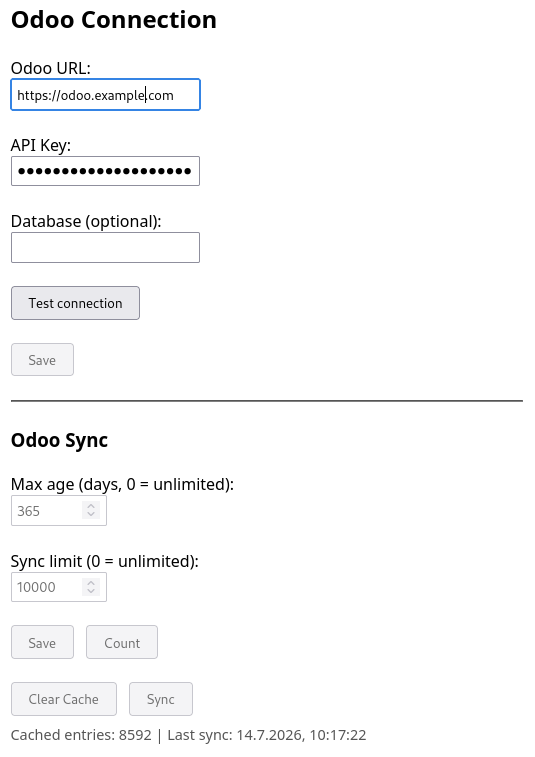
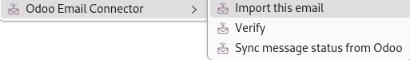
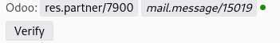
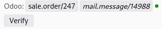
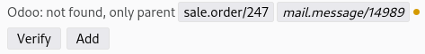
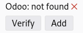

# Odoo Email Connector

This Thunderbird add-on imports emails into the ERP software [Odoo](https://www.odoo.com) (version 19+) and shows their Odoo status inline in the message reader.

## Requirements

* Odoo >= 19 (the [External JSON-2 API](https://www.odoo.com/documentation/19.0/developer/reference/external_api.html) was introduced in Odoo 19)
* Optional:
  * [mail_manual_routing](https://apps.odoo.com/apps/modules/19.0/mail_manual_routing) to handle new and unrelated emails that are otherwise not visible in Odoo. For details, see [faotools mail_manual_routing](https://faotools.com/apps/19.0/lost-messages-routing-19-0-mail-manual-routing-1037).
    * Without this extension, emails imported as *Generic* may not be visible.

## Setup

* Odoo:
  * Create an API key: *User → My Preferences → Security → API Keys → Add API key* (see [Odoo documentation](https://www.odoo.com/documentation/19.0/developer/reference/external_api.html#configuration))
* Thunderbird:
  * Install the add-on [Odoo Email Connector](https://addons.thunderbird.net/thunderbird/addon/odoo-email-connector/)
  * Open the add-on's **Options** page:
    * Set **Odoo URL** to your Odoo server.
    * Set **API Key**.
    * Set **Database** if required (normally not).
    * 
  * Click *Test connection* — you will be prompted to grant host permission. If successful, click *Save*.

## Usage

The add-on never contacts the Odoo server automatically. Server requests are only made when explicitly triggered by the user:

- clicking **Verify** or **Add** in the status bar
- selecting **Verify** or **Import this email** from the right-click menu
- selecting **Sync from Odoo** from the right-click menu

### Context Menu

Right-click one or more emails in the message list and select **Odoo Email Connector**:

| Menu item   | Action |
|-------------|--------|
| **Import this email** | Checks Odoo; if not found, checks the parent thread (In-Reply-To / References). Offers to import as *Opportunity (CRM Lead)* or *Generic*. |
| **Verify** | Checks selected emails against Odoo and caches the result. Shows count label (e.g. *Verify 3 messages*). |
| **Sync from Odoo** | Bulk-fetches message IDs from Odoo (within max-age window) into the local cache. |

### Status Bar

When viewing an email, a colored status bar may appear at the top of the message pane. It only
displays information from the local cache — viewing an email never triggers an Odoo server request.
If nothing is cached for the current email, the status bar is not shown and no server request is made,
keeping performance impact minimal for non-Odoo emails.

- message found in Odoo
  - 
  - 
- message not found, but a parent/reply predecessor was found in Odoo
  - 
- message and predecessors not found in Odoo
  - 

Buttons in the bar:
- **Verify** — re-check this email against Odoo
- **Add** — import the email into Odoo

Results are cached per message and persist across restarts.

### Options Page

The options page has two sections:

**Odoo Connection** — URL, API key, database, test connection, save.

**Odoo Sync** — Settings for bulk sync:
- **Max age (days)** — how far back to look. 0 = unlimited.
- **Sync limit** — maximum messages to fetch. 0 = unlimited.
- **Count** — preview how many messages Odoo will return.
- **Sync** — incremental sync from Odoo.
- **Clear Cache** — delete all cached statuses.
- Displays cache entry count and last sync time (auto-refreshes).
